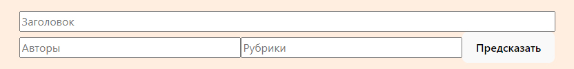
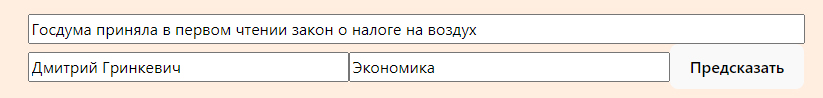
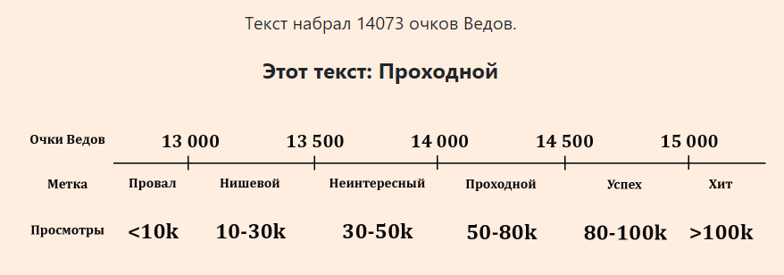

## ВЕДЫ
### Система предсказания просмотров газетных статей


Веды - это инструмент, который позволит журналистам оценить потенциальное число просмотров своих статей на основе заголовка, авторского состава и рубрик текста.

В основе Ведов лежит датасет статей газеты "Ведомости", опубликованных в период с октября 2023 по февраль 2024 гг. Простая регрессионная модель предсказывает условные единицы просмторов (баллы Ведов), на основе которых выставляется оценка потенциальной успешности текста. 

## Как это работает:
1) Ввод данных в модель

Для начала мы должны ввести данные интересующей нас статьи, - заголовок, авторов, рубрики, - в соотвтествующие поля.



Закголовок вводится полностью, без подзаголовка. Авторы и рубрики должны обязательно вводиться с учётом заглавных букв - так. Если их несколько, то нужно перечислить их через запятую (Например: Василий Пупкин, Иван Иванов ИЛИ Экономика, Политика).



2) Предсказание и интерпретация

Когда все данные введены, мы можем нажать на кнопку "Предсказать".

Модель посчитает и выведет баллы Ведов для нашей статьи а также метку текста. По такбличке ниже мы можем интерпретировать предсказание, понять, сколько реальных просмотров может набрать текст. 



## Для локального запуска:
Если система запускается локально, необходимо открыть два терминала.

В первом перейти (cd) к в директорию /fast_api и запустить в ней команду 
```
uvicorn main:app --host 0.0.0.0 --port 8000
```
Во втором перейти в дерикторию /react и запустить в ней команду
```
npm run dev
```
